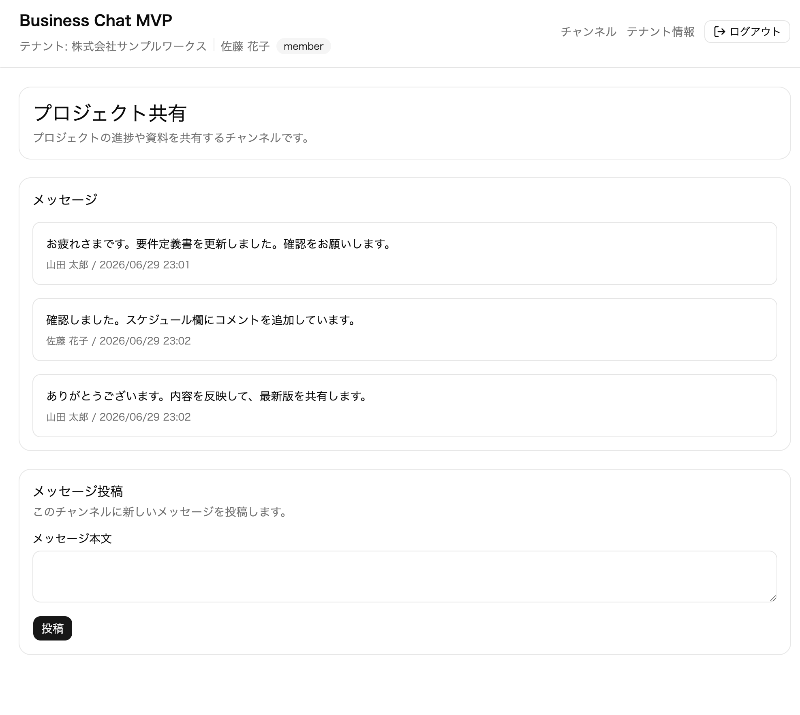

# business-chat-mvp

転職活動用ポートフォリオとして作成した、業務用チャットアプリのMVPです。

小規模な組織での情報共有を想定し、認証、テナント分離、チャンネル管理、メッセージ投稿を実装しています。

## デモ

デモ URL: [https://business-chat-mvp.vercel.app/](https://business-chat-mvp.vercel.app/)

公開デモでは、環境設定により新規テナント作成を無効化できます。既存テナントへの参加には参加コードが必要です。



## 作成目的

このアプリは、自社開発企業への転職において、Webアプリケーションを一人で設計、実装、テストまで進められることを示すために作成しています。

その題材として、小規模組織の情報共有を想定した簡易的な業務用チャットアプリを作成しています。

単なるチャット画面ではなく、業務アプリとして必要な認証、テナント管理、権限制御、データ設計、テスト方針まで含めて整理することを重視しています。

## 主な機能

- ユーザー登録
- ログイン、ログアウト
- 新規テナント作成
- 参加コードによる既存テナント参加
- チャンネル一覧表示
- 管理者ユーザーによるチャンネル作成
- チャンネル内メッセージ投稿、表示
- メッセージのリアルタイム反映
- 所属テナント情報の表示

## 技術スタック

- フロントエンド: Next.js / TypeScript
- UI: React / Tailwind CSS / shadcn/ui
- 認証: Firebase Authentication
- データベース: Cloud Firestore
- サーバー側処理: Next.js Route Handler / Firebase Admin SDK
- テスト: Vitest / React Testing Library / Playwright

## 設計上の見どころ

### 認証とテナント分離

ユーザーは必ず1つのテナントに所属し、テナント単位でチャンネルとメッセージを管理します。

ログイン後の通常操作では、Firebase Client SDK と Firestore Security Rules により、所属テナント内のデータだけを扱えるようにしています。

### 登録・参加処理

新規テナント作成と既存テナント参加は、Next.js Route Handler と Firebase Admin SDK で処理します。

参加コード検索、`role`、`tenantId`、`createdBy` の決定をサーバー側に寄せることで、権限の根拠をブラウザ側の自己申告に依存しない構成にしています。

### 権限制御

Firestore Security Rules では、主に以下を制御しています。

- 自分のユーザー情報のみ参照可能
- 所属テナントのみ参照可能
- クライアントから `users` / `tenants` は作成不可
- 管理者のみチャンネル作成可能
- 所属テナント内の既存チャンネルにのみメッセージ投稿可能

## テスト

このプロジェクトでは、関数、コンポーネント、E2E、Firestore Security Rules をテスト対象にしています。

```bash
npm run test
npm run test:rules
npm run test:e2e
```

## ローカルでの確認方法

依存関係をインストールします。

```bash
npm install
```

`.env.local.example` を参考に `.env.local` を作成します。

公開デモで新規テナント作成を止める場合は、デプロイ環境で次の両方を `true` に設定します。`DISABLE_PUBLIC_TENANT_SIGNUP` は Route Handler で作成要求を拒否するための必須設定で、`NEXT_PUBLIC_DISABLE_TENANT_SIGNUP` は画面上の作成導線を非表示にします。未設定または `false` の場合は新規テナントを作成できます。

```dotenv
DISABLE_PUBLIC_TENANT_SIGNUP=true
NEXT_PUBLIC_DISABLE_TENANT_SIGNUP=true
```

開発サーバーを起動します。

```bash
npm run dev
```

ブラウザで以下を開きます。

```text
http://localhost:3000
```

## ドキュメント

詳細な設計内容は `docs/` 配下に整理しています。

- [想定ユーザーと課題](./docs/01-users.md)
- [MVPスコープ](./docs/02-scope.md)
- [機能要件](./docs/03-requirements.md)
- [データ設計](./docs/04-data-model.md)
- [データ処理フロー](./docs/05-data-flow.md)
- [画面設計](./docs/06-screens.md)
- [技術構成](./docs/07-tech-stack.md)
- [テスト方針](./docs/08-test-policy.md)
- [ドキュメント管理方針](./docs/09-documentation-policy.md)
- [デプロイ確認チェックリスト](./docs/10-deployment-checklist.md)

## 今後の改善点

- メッセージ検索、通知、ファイル添付、既読管理などのチャット機能拡張
- 複数テナント所属や複数管理者への対応
